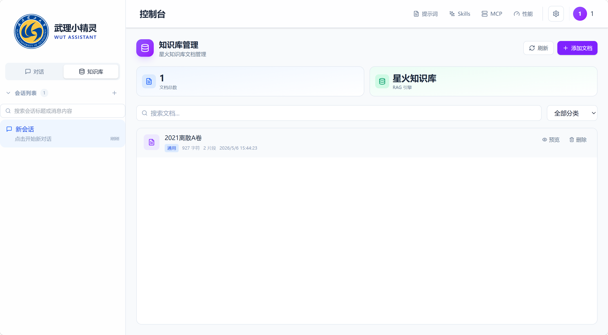

# WUT RAG Copilot / 武理小精灵

   

基于 RAG 知识库增强的武理校园 AI 助手。支持智能对话、流式输出、文件上传、多会话管理、知识库问答、教务系统集成（查成绩/课表/考试）、AgentHub 工具调用、记忆系统、RAGAS 评测、深色模式等。

A RAG-enhanced AI copilot for WUT campus — intelligent chat, streaming output, file upload, multi-conversation, knowledge base Q&A, school system integration (grades/schedule/exams), AgentHub tool calling, memory system, RAGAS evaluation, dark mode.

---

## ✨ 功能特性

### 核心功能
- **AI 智能对话** — Vue 3 + Composition API 即时聊天界面，支持 SSE 流式输出
- **文件上传对话** — 支持上传图片、PDF、Word、TXT，AI 自动读取内容
- **多会话管理** — 创建、切换、重命名、删除会话，本地持久化
- **RAG 知识库** — 文档上传 → 向量化 → 检索增强回答（讯飞 ChatDoc）
- **AgentHub 工具** — AI 自动调用工具（教务查询、计算器、记忆检索等）
- **教务系统集成** — 绑定学号密码，自动查成绩、课表、考试安排
- **记忆系统** — 短期记忆 + 长期记忆 + 用户画像，跨会话上下文感知
- **RAGAS 评测** — 内置评测数据集，自动评估 RAG 管道质量
- **提示词管理** — 自定义系统提示词，按分类筛选
- **Markdown 渲染** — 标题、粗体、代码块（highlight.js）、表格等
- **语音输入** — 浏览器语音识别（中文）
- **深色模式** — 日间/夜间主题切换，状态持久化
- **登录页面** — 独立登录页，httpOnly cookie 认证
- **设置页面** — AI 模型配置、系统设置

### 技术特点
- **前后端分离** — Vue 3 前端 + Express 后端，支持独立部署
- **模拟模式** — 未配置 API Key 时自动使用模拟响应，本地开发零配置
- **In-Memory 存储** — 无需 Redis，数据持久化到 JSON 文件
- **Web Worker** — Markdown 渲染在 Worker 线程执行，不阻塞 UI
- **连接状态管理** — 心跳检测 + 断线自动重连 + 待发送队列

---

## 🖼️ 演示




---

## 🚀 快速开始

### 前提条件

- Node.js >= 18
- npm

### 启动前端（项目根目录）

```bash
npm install
npm run dev
```

### 启动后端（`backend/` 目录）

```bash
cd backend
npm install
cp .env.example .env   # 编辑 .env，填入必要环境变量
npm run dev
```

前端 → `http://localhost:5173`，后端 → `http://localhost:3000`。

---

## 📦 安装

```bash
git clone https://github.com/L123121/Vue3_WUT_LLM.git
cd Vue3_WUT_LLM

# 前端
npm install
npm run dev

# 后端
cd backend
npm install
cp .env.example .env
# 编辑 backend/.env，填入 AI_API_KEY、JWT_SECRET、SCHOOL_ENC_KEY
npm run dev
```

---

## 📖 使用方法

### 登录
访问 `http://localhost:5173/login`，使用教务系统学号密码登录，或任意账号 + 密码 `123456`。

### AI 聊天
输入框输入问题，Enter 发送。AI 流式返回回复。

### 文件上传
点击输入框左侧 📎 按钮，选择文件（支持图片/PDF/Word/TXT），AI 自动读取文件内容并回答。

### 会话管理
左侧边栏：`+` 创建新会话、点击标题重命名、删除图标删除。

### 知识库 (RAG)
进入「知识库」页面，上传文档 → 聊天时 AI 基于知识库内容回答。

### 教务系统
绑定学号密码后，可直接查询成绩、课表、考试安排。

### 记忆系统
AI 自动记住你的偏好和上下文，跨会话保持连贯对话。

### 评测 (Eval)
进入「评测」页面，运行 RAGAS 评测，查看系统回答质量指标。

### 提示词
右上角「提示词」→ 新建/编辑/删除提示词，选中后作为系统提示生效。

---

## 📚 API 文档

### 接口总览

| 方法 | 路径 | 描述 |
|------|------|------|
| **通用** |
| GET | `/api/health` | 健康检查 |
| GET | `/api` | API 列表 |
| POST | `/api/auth/logout` | 用户登出 |
| **聊天** |
| POST | `/api` | 聊天接口（非流式） |
| POST | `/api/chat` | 聊天接口（兼容） |
| POST | `/api/stream` | SSE 流式聊天 |
| POST | `/api/chat/upload` | 聊天文件上传 |
| POST | `/api/chat/title` | 生成会话标题 |
| **会话管理** |
| GET | `/api/conversations` | 获取会话列表 |
| POST | `/api/conversations` | 创建会话 |
| GET | `/api/conversations/:id` | 会话详情 |
| PUT | `/api/conversations/:id` | 更新会话 |
| DELETE | `/api/conversations/:id` | 删除会话 |
| DELETE | `/api/conversations/:id/messages` | 清空会话消息 |
| **RAG 知识库** |
| POST | `/api/rag/chat` | RAG 增强聊天 |
| POST | `/api/rag/chat/stream` | RAG 流式聊天 |
| POST | `/api/rag/documents` | 添加文档 |
| POST | `/api/rag/documents/upload` | 上传文档 |
| POST | `/api/rag/documents/batch` | 批量添加文档 |
| GET | `/api/rag/documents` | 文档列表 |
| GET | `/api/rag/documents/:id` | 文档详情 |
| DELETE | `/api/rag/documents/:id` | 删除文档 |
| GET | `/api/rag/stats` | RAG 统计 |
| **教务系统** |
| POST | `/api/school/login` | 教务系统登录（公开） |
| POST | `/api/school/bind` | 绑定学校账号 |
| GET | `/api/school/status` | 查询绑定状态 |
| DELETE | `/api/school/bind` | 解绑学校账号 |
| GET | `/api/school/grades` | 查询成绩 |
| GET | `/api/school/schedule` | 查询课表 |
| GET | `/api/school/exams` | 查询考试安排 |
| GET | `/api/school/semesters` | 获取学期列表 |
| **Agent 工具** |
| GET | `/api/tools` | 列出所有工具 |
| GET | `/api/tools/stats` | 工具统计 |
| GET | `/api/tools/:name` | 工具详情 |
| PUT | `/api/tools/:name/toggle` | 切换工具启用/禁用 |
| DELETE | `/api/tools/:name` | 移除工具 |
| POST | `/api/tools/execute` | 手动执行工具 |
| **记忆系统** |
| GET | `/api/memory` | 获取所有记忆 |
| GET | `/api/memory/stats` | 记忆统计 |
| GET | `/api/memory/long-term` | 获取长期记忆 |
| POST | `/api/memory/long-term` | 添加长期记忆 |
| DELETE | `/api/memory/long-term/:id` | 删除长期记忆 |
| PUT | `/api/memory/profile` | 更新用户画像 |
| DELETE | `/api/memory` | 清空所有记忆 |
| **评测** |
| GET | `/api/eval/metrics` | 获取系统实时指标 |
| POST | `/api/eval/run` | 运行 RAGAS 评测（SSE） |
| POST | `/api/eval/metrics` | 批量计算评测指标 |
| GET | `/api/eval/health` | 评测服务健康检查 |

### 请求示例

**流式聊天 (`POST /api/stream`)**
```json
{
  "message": "你好",
  "history": [],
  "conversationId": "conv_123",
  "enableRag": true,
  "files": [{ "name": "手册.pdf", "textContent": "...", "isImage": false }]
}
```

SSE 响应：
```
data: {"content": "你"}
data: {"content": "好"}
data: [DONE]
```

**文件上传 (`POST /api/chat/upload`)**
`multipart/form-data`，字段名 `file`。返回：
```json
{
  "success": true,
  "data": {
    "url": "/uploads/xxx",
    "name": "考试要点.docx",
    "textContent": "...",
    "isImage": false
  }
}
```

---

## ⚙️ 环境变量

| 变量 | 默认值 | 说明 |
|------|--------|------|
| `PORT` | `3000` | 后端端口 |
| `NODE_ENV` | `development` | 运行环境 |
| `AI_API_KEY` | (无) | LLM API Key（必须） |
| `AI_BASE_URL` | `https://maas-api.cn-huabei-1.xf-yun.com` | AI 服务地址 |
| `AI_MODEL` | `xopqwen36v35b` | 模型名称 |
| `AI_MAX_TOKENS` | `4000` | 最大 Token 数 |
| `JWT_SECRET` | (无) | JWT 签名密钥（必须） |
| `XUNFEI_API_KEY` | (无) | 讯飞 API Key（RAG 用） |
| `XUNFEI_APP_ID` | (无) | 讯飞 APP ID（RAG 用） |
| `SCHOOL_TP_HOST` | `https://one.whut.edu.cn` | 武理统一身份认证地址 |
| `SCHOOL_JW_HOST` | `https://jwxt.whut.edu.cn` | 武理教务系统地址 |
| `SCHOOL_ENC_KEY` | (无) | 教务系统加密密钥（必须） |
| `VITE_API_BASE_URL` | (无) | 前端 API 地址（部署时设置，如 `https://your-api.com/api`） |

---

## 📁 项目结构

```
├── backend/                          # Express 后端
│   ├── src/
│   │   ├── app.js                    # 入口（中间件 + 路由注册）
│   │   ├── config/index.js           # 配置（环境变量读取）
│   │   ├── middleware/
│   │   │   ├── index.js              # 中间件组装（速率限制等）
│   │   │   └── auth.middleware.js    # JWT 认证中间件
│   │   ├── routes/
│   │   │   ├── register.js           # 路由注册入口
│   │   │   ├── index.js              # 子路由聚合
│   │   │   ├── conversations.routes.js  # 会话管理
│   │   │   ├── rag.routes.js         # RAG 知识库
│   │   │   ├── school.routes.js      # 教务系统
│   │   │   ├── eval.routes.js        # RAGAS 评测
│   │   │   ├── tool.routes.js        # Agent 工具
│   │   │   └── memory.routes.js      # 记忆系统
│   │   ├── controllers/
│   │   │   └── chat.controller.js    # 聊天控制逻辑
│   │   ├── services/
│   │   │   ├── ai.service.js         # AI 服务（OpenAI 兼容）
│   │   │   ├── xunfei.service.js     # 讯飞星火服务
│   │   │   ├── chatdoc.service.js    # ChatDoc RAG 服务
│   │   │   ├── rag.service.js        # RAG 编排
│   │   │   ├── document.service.js   # 文档处理
│   │   │   ├── embedding.service.js  # 向量化
│   │   │   ├── school-api.service.js # 教务系统 API
│   │   │   ├── school-session.service.js # 教务会话管理
│   │   │   ├── agent.service.js      # Agent 编排
│   │   │   ├── agent-handlers.js     # Agent 处理逻辑
│   │   │   ├── agent-tools.js        # Agent 工具定义
│   │   │   ├── tool-registry.service.js  # 工具注册表
│   │   │   ├── deterministic-tools.js    # 确定性工具
│   │   │   ├── react-planner.service.js   # 推理规划器
│   │   │   ├── memory.service.js     # 记忆服务
│   │   │   ├── memory-store.js       # 记忆存储（JSON + 内存）
│   │   │   ├── memory/
│   │   │   │   ├── helpers.js
│   │   │   │   ├── short-term-memory.js
│   │   │   │   ├── long-term-memory.js
│   │   │   │   └── user-profile.js
│   │   │   ├── metrics.service.js    # 评测指标
│   │   │   ├── analysis.service.js   # 分析服务
│   │   │   └── redis-store.js        # Redis 兼容存储
│   │   └── utils/
│   │       └── httpClient.js         # HTTP 客户端
│   └── package.json
├── src/                              # Vue 3 前端
│   ├── main.js                       # 入口
│   ├── App.vue                       # 根组件
│   ├── router/index.js               # 路由
│   ├── stores/                       # Pinia 状态管理
│   │   ├── auth.store.js             # 认证状态
│   │   ├── chat.store.js             # 聊天状态
│   │   ├── conversation.store.js    # 会话管理 + 持久化
│   │   ├── message.store.js          # 消息管理
│   │   ├── skill.store.js            # Skills
│   │   ├── eval.store.js             # 评测状态
│   ├── api/                          # API 请求
│   │   ├── client.js                 # 请求封装
│   │   ├── chat.js                   # 聊天 API + SSE
│   │   ├── conversations.js          # 会话 API
│   │   ├── rag.js                    # RAG API
│   │   ├── school.js                 # 教务 API
│   │   ├── eval.js                   # 评测 API
│   ├── views/
│   │   ├── Login.vue                 # 登录页
│   │   ├── AIChat.vue                # 聊天主界面
│   │   ├── KnowledgeBase.vue         # 知识库
│   │   ├── EvalScoring.vue           # 评测
│   │   ├── Settings.vue              # 设置
│   ├── components/
│   │   ├── chat/
│   │   │   ├── ChatBox.vue           # 输入框（含文件上传）
│   │   │   ├── MessageList.vue       # 消息列表
│   │   │   ├── MessageBubble.vue     # 消息气泡
│   │   │   ├── MarkdownRenderer.vue  # Markdown 渲染
│   │   │   ├── AgentThinking.vue     # Agent 思考过程
│   │   │   ├── AgentToolCall.vue     # 工具调用展示
│   │   │   ├── ConversationList.vue  # 会话列表
│   │   │   ├── VoiceRecorder.vue     # 语音输入
│   │   │   └── ...
│   │   ├── layout/Sidebar.vue        # 侧边栏
│   │   ├── common/
│   │   │   ├── ErrorBoundary.vue     # 错误边界
│   │   │   ├── LoginModal.vue        # 登录弹窗
│   │   ├── eval/                     # 评测组件
│   │       ├── RagasDashboard.vue
│   │       ├── EvalContentViewer.vue
│   │       └── SystemMetricsPanel.vue
│   ├── composables/                  # 组合式函数
│   │   ├── useMarkdownRenderer.js
│   │   ├── useStreaming.js
│   │   ├── useMessageActions.js
│   │   ├── useEvalData.js
│   │   └── useSystemMetrics.js
│   ├── utils/                        # 工具函数
│   │   ├── chatHelpers.js
│   │   ├── errorHandler.js
│   │   ├── conversationCache.js
│   │   └── markdownConfig.js
│   ├── workers/                      # Web Workers
│   │   └── markdown.worker.js        # Markdown 渲染 Worker
│   └── __tests__/                    # 前端测试
├── uploads/                          # 上传文件存储
├── data/                             # 后端持久化数据
│   └── store.json                    # 记忆存储文件
├── scripts/                          # 调试/评测脚本
│   └── rag-eval/                     # RAGAS 评测数据集
├── package.json                      # 前端依赖
├── vite.config.js                    # Vite 配置
└── README.md
```

---

## 🛠️ 技术栈

### 前端
- **Vue 3.5** — Composition API + `<script setup>`
- **Pinia 2.1** — 状态管理
- **Vue Router 4** — 路由
- **Tailwind CSS 4** — 原子化 CSS
- **Vite 6** — 构建工具
- **highlight.js** — 代码高亮
- **markdown-it** — Markdown 解析
- **lucide-vue-next** — 图标
- **DOMPurify** — XSS 防护
- **Web Worker** — 离线渲染

### 后端
- **Node.js + Express 4**
- **jsonwebtoken** — JWT 认证
- **multer** — 文件上传
- **mammoth** — Word 文档解析
- **pdf-parse** — PDF 解析
- **puppeteer** — 无头浏览器（教务系统爬取）
- **helmet** — 安全头
- **morgan** — 日志
- **express-rate-limit** — 速率限制
- **ioredis** — Redis 兼容存储
- **mathjs** — 数学计算
- **ws** — WebSocket

### 数据存储
- **In-Memory + JSON 文件** — 会话数据持久化
- **localStorage** — 前端缓存与备份
- **讯飞 ChatDoc** — 向量化 + RAG 知识库

### AI 服务
- **讯飞星火 / 通义千问**（OpenAI 兼容接口）

---

## 🚢 部署

### 前端 → Vercel（推荐）

1. 推送代码到 GitHub
2. [Vercel](https://vercel.com) 导入项目
3. Build Command: `npm run build`，Publish Directory: `dist`
4. 在 Environment 中设置 `VITE_API_BASE_URL=https://your-backend.com/api`

### 后端 → 阿里云学生机

1. 购买阿里云轻量应用服务器（2核 2G，Ubuntu 22.04）
2. SSH 登录后安装 Node.js、PM2、Nginx
3. 克隆代码，配置 `backend/.env`
4. `npm install && npm run build && pm2 start backend/src/app.js`
5. 配置 Nginx 反向代理

详细步骤见 [部署指南](https://github.com/L123121/Vue3_WUT_LLM/wiki/部署指南)。

### 后端 → Render（免费版）

1. [Render](https://render.com) 注册账号
2. 新建 Web Service，Root Directory 填 `backend`
3. Build Command: `npm install`，Start Command: `node src/app.js`
4. 添加环境变量（AI_API_KEY、JWT_SECRET 等）
5. 新建 Static Site 部署前端

---

## 🤝 贡献

1. Fork → `git checkout -b feature/xxx`
2. Commit → Push → PR

### 提交规范
`feat` / `fix` / `docs` / `style` / `refactor` / `test` / `chore`

---

## 📄 许可证

MIT

---

## 联系方式

- 项目: https://github.com/L123121/Vue3_WUT_LLM
- Issues: GitHub Issues
